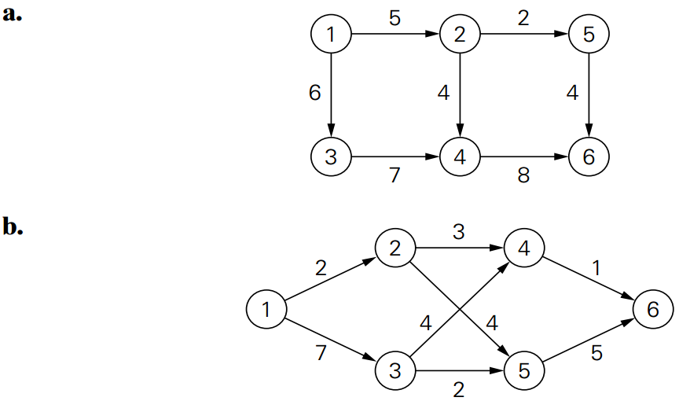
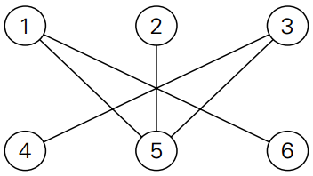

# CMPSC 465 Assignment - Iterative Improvement

## Name: Anthony Vallin		PSU Username:aav5195

## Format Requirement

- Algorithms in pseudo code **MUST** be placed in code blocks/fences (5%), and use either `cpp` or `java` as the syntax highlight. 


- Algorithms should follow the pseudo code standard described in handout 1. (2%)
- Do NOT change the template except the answer portion. (5%)
- Formulas and equations should be in math mode using Latex math symbols. (5%)
  - Markdown math tutorial: http://csrgxtu.github.io/2015/03/20/Writing-Mathematic-Fomulars-in-Markdown/ 
  - Two ways to enter math mode:
    - Insert a pair of dollar signs: \$ your equations go here \$. This is the inline math mode.
    - Insert a pair of double-dollar signs: \$\$ your equations go here \$\$, which produces a standalone equation/formula set.

## Problem Set 

### Problem 1

Apply the shortest-augmenting path algorithm to find a maximum flow in the following networks. 



#### Answer:

1a:


1b:


---

### Problem 2

Explain how the maximum-flow problem for a network with several sources and sinks can be transformed into the same problem for a network with a single source and a single sink.

#### Answer:

Add a new vertices source and sink. Connect the new source to the existing sources and connect the existing sinks to the new sink.  

------

### Problem 3 

Consider a network that is a rooted tree, with the root as its source, the leaves as its sinks, and all the edges directed along the paths from the root to the leaves. Design an efficient algorithm for finding a maximum flow in such a network. What is the time efficiency of your algorithm? **Describe your algorithm step by step**.

#### Answer:

```C++
Algorithm MaxFlow(T(r), v)
//Find maximum flow for tree T(r) rooted at r, whose value doesn't exceed v
//Input: Tree T(r) and root value
//Output: Maximum flow value
If r == leaf do
    maxflow <- v  //assigned root value if rooted tree has no children
else 
   maxflow <- 0
   for every child c of r do
       x <- MaxFlow(T(c), min(u,v)) //Find reasonable flow value
       v <- v - x //Cut edges from x to v
       maxflow <- maxflow + x //Sum flow values
return maxflow
```
Time efficiency: $\theta(1)$

------

### Problem 4 

What is the largest and what is the smallest possible cardinality of a matching in a bipartite graph $G = <V, U, E>$ with $n$ vertices in each vertex set $V$ and $U$ and at least $n$ edges?

#### Answer:

The largest cardinality of a matching in a bipartite graph is when all the vertices are perfectly matched. The smallest cardinality of a matching bipartite graph is one. 

------

### Problem 5

What is the largest and what is the smallest number of distinct solutions the maximum-cardinality-matching problem can have for a bipartite graph $G = <V, U, E>$ with $n$ vertices in each vertex set $V$ and $U$ and at least $n$ edges?

#### Answer

The largest number of distinct solutions is n! and the smallest number of distinct solutions is one. 

------

### Problem 6

Apply the maximum-matching algorithm to the following bipartite graph:



#### Answer


